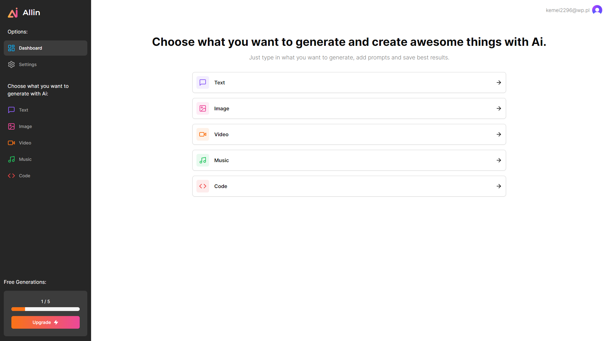

# [Allin ai](https://allin-ai-puce.vercel.app/)

[](https://allin-ai-puce.vercel.app/)

## Description

This App is my take on a web service with Ai tools. The app uses the public but limited free version of OpenAi API and Replicate API  to generate: text, code, image, music and video. The app offers a free tier where the users are allowed to generate 5 different items. The users also have an option to upgrade to a pro version of the app which allows them to generate an unlimited amount of items. To create this app, I used Next.Js with App Router, Clerk for authentication, Stripe for payment processing, PlanetScale as the database,  Zustand for state management, and Tailwind with Shad/cn for styling. Payments are based on monthly subscriptions. Authentication allows users to sign up with a github or google account, or with an email address.

I created this app for learning purposes. This project allowed me to learn how to create full stack apps on the newest version of next.js and how to use external services and different tools. This app uses basic free tiers of different ai tools which can expire and might be unable to be used after reaching the maximum number of generations or after some period of time. Stripe as the payment service is set in the test mode and will confirm the payment whenever the user enters valid data.


## Tech Stack

- [Next.js](https://nextjs.org)
- [Tailwind CSS](https://tailwindcss.com)
- [Zustand](https://zustand-demo.pmnd.rs/)
- [Shadcn/Ui](https://ui.shadcn.com/)
- [Prisma](https://www.prisma.io/nextjs)
- [Clerk](https://clerk.com/)
- [Stripe](https://stripe.com/)
- [OpenAi](https://openai.com/)
- [Replicate](https://replicate.com/)

## Installation

### 1. Clone the repository

```bash
git clone https://github.com/ilisiecki/allin-ai.git
```

### 2. Install dependencies

```bash
npm install
```

### 3. Create a `.env` file

Create a `.env` file in the root directory and add the environment variables as shown in the `.env.example` file.


### 4. Run the application

```bash
npm run dev
```

### 5. View the application

Open [http://localhost:3000](http://localhost:3000)  with your browser to see the result.

## Deploy on Vercel

The easiest way to deploy your Next.js app is to use the [Vercel Platform](https://vercel.com/new?utm_medium=default-template&filter=next.js&utm_source=create-next-app&utm_campaign=create-next-app-readme) from the creators of Next.js.

Check out our [Next.js deployment documentation](https://nextjs.org/docs/deployment) for more details.
